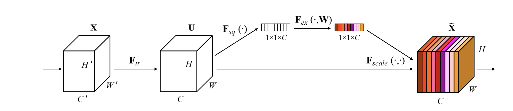

# SENet on CIFAR-10

<hr>

## Contents

1. [Highlights](#Highlights)
2. [SENet Primer](#ResNet)
3. [Requirements](#Requirements)
4. [Usage](#Usage)
5. [Results](#Results)


<hr>

## Highlights
This project is an implementation from scratch of a slightly modified version of the Squeeze and Excitation ResNet introduced in the paper [Squeeze-and-Excitation Networks](https://arxiv.org/abs/1709.01507). We implement this model on the small scale benchmark dataset `CIFAR-10`. One of the goals of this project is to illustrate the speed gain of the ResNet model in comparison to the vision transformer models while maintaining comparable accuracy on `CIFAR-10` and other small-scale datasets. 

<hr>

## Squeeze and Excitation ResNet Primer
The structure of the SE building block is depicted below. For any given transformation $\mathbf{F}_{t r}$ mapping the input $\mathbf{X}$ to the feature maps $\mathbf{U}$ where $\mathbf{U} \in \mathbb{R}^{H \times W \times C}$, e.g. a convolution, we can construct a corresponding SE block to perform feature recalibration. The features $\mathbf{U}$ are first passed through a squeeze operation, which produces a channel descriptor by aggregating feature maps across their spatial dimensions $(H \times W)$. The function of this descriptor is to produce an embedding of the global distribution of channel-wise feature responses, allowing information from the global receptive field of the network to be used by all its layers. The aggregation is followed by an excitation operation, which takes the form of a simple self-gating mechanism that takes the embedding as input and produces a collection of per-channel modulation weights. These weights are applied to the feature maps $\mathbf{U}$ to generate the output of the SE block which can be fed directly into subsequent layers of the network.

</img>

Below we illustrate the difference between a typical residual block in a resnet architecture and the residual block in the SENet architecture

</img>

<hr>

## Requirements
```shell
pip install -r requirements.txt
```

<hr>

## Usage
To replicate the reported results, clone this repo
```shell
cd your_directory git clone git@github.com:jordandeklerk/SE-ResNet-pytorch.git
```
and run the main training script
```shell
python train.py 
```

<hr>

## Results
We test our approach on the `CIFAR-10` dataset with the intention to extend our model to 4 other small low resolution datasets: `Tiny-Imagenet`, `CIFAR100`, `CINIC10` and `SVHN`. All training took place on a single A100 GPU.
  * CIFAR10
    * ```SEresnet_cifar10_input32``` - 92.4 @ 32

Flop analysis:
```
total flops: 127105568
total activations: 545849
number of parameter: 861818
| module   | #parameters or shape   | #flops   |
|:---------|:-----------------------|:---------|
| model    | 0.862M                 | 0.127G   |
|  conv1   |  0.432K                |  0.442M  |
|  bn1     |  32                    |  32.768K |
|  layer1  |  42.336K               |  43.205M |
|  layer2  |  0.164M                |  41.805M |
|  layer3  |  0.654M                |  41.616M |
|  fc      |  0.65K                 |  0.64K   |
|  avgpool |                        |  4.096K  |
```
   
<hr>

## Citations
```bibtex
@article{hu2018senet,
  title={Squeeze-and-Excitation Networks},
  author={Jie Hu and Li Shen and Gang Sun},
  journal={IEEE Conference on Computer Vision and Pattern Recognition},
  year={2018}
}
```
